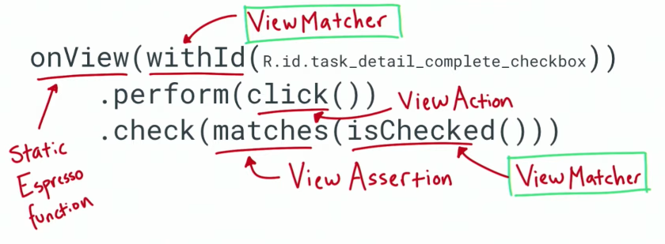

TO-DO Notes - Code for 5.1-5.3 Testing Codelab
============================================================================

Code for the Advanced Android Kotlin Testing Codelab 5.1-5.3

Introduction
------------

TO-DO Notes is an app where you to write down tasks to complete. The app displays them in a list.
You can then mark them as completed or not, filter them and delete them.


This codelab has four branches, representing different code states:

* [starter_code](https://github.com/googlecodelabs/android-testing/tree/starter_code)
* [end_codelab_1](https://github.com/googlecodelabs/android-testing/tree/end_codelab_1)
* [end_codelab_2](https://github.com/googlecodelabs/android-testing/tree/end_codelab_2)
* [end_codelab_3](https://github.com/googlecodelabs/android-testing/tree/end_codelab_3)

The codelabs in this series are:
* [Testing Basics](https://codelabs.developers.google.com/codelabs/advanced-android-kotlin-training-testing-basics)
* [Introduction to Test Doubles and Dependency Injection](https://codelabs.developers.google.com/codelabs/advanced-android-kotlin-training-testing-test-doubles)
* [Survey of Testing Topics](https://codelabs.developers.google.com/codelabs/advanced-android-kotlin-training-testing-survey)


Pre-requisites
--------------

You should be familiar with:

* The Kotlin programming language, including [Kotlin coroutines](https://developer.android.com/kotlin/coroutines) and their interaction with [Android Jetpack components](https://developer.android.com/topic/libraries/architecture/coroutines).
* The following core Android Jetpack libraries: [ViewModel](https://developer.android.com/topic/libraries/architecture/viewmodel),
 [LiveData](https://developer.android.com/topic/libraries/architecture/livedata),
  [Navigation Component](https://developer.android.com/guide/navigation) and 
  [Data Binding](https://developer.android.com/topic/libraries/data-binding).
* Application architecture, following the pattern from the [Guide to app architecture](https://developer.android.com/jetpack/docs/guide) and [Android Fundamentals codelabs](https://developer.android.com/courses/kotlin-android-fundamentals/toc).


Getting Started
---------------

1. Download and run the app.
2. Check out one of the codelabs mentioned above.

# My notes

This course is set out in a nice way.  We get the theory, then a quiz, then self practice and then a runthrough of the answer.   This helps to drive the point home and it's a really fun course.

You start of a new project with main `code`, `test` and `androidTest` folders (source sets).  
The main source set does not know about the test and androidTest directory.  
test and androidTest also dont know about each other.   Also no test code will be compiled to the APK.
Dependencies are also test scoped using Gradle test configurations.

Need to have @Test inside a test source set.  Using Junit library.

### `test` vs. `androidTest`

| `test`                                     | `androidTest`            |
|:-------------------------------------------|:-------------------------|
| Local tests                                | Instrumented tests       |
| Local JVM                                  | Real or emulated devices |
| Faster                                     | Slower                   |
| Less fidelity (how real world the test is) | More fidelity            |
| Red and green play icon                    | Android icon             |

`androidTest` can get a context using `InstrumentationRegistry`.  Instrument test when
it will benefit from running on an Android device.   Remember to use `@RunWith(AndroidJunit4::class)`.

You can share classes between `test` and `androidTest`. It's done [via Gradle](https://github.com/android/architecture-samples/blob/f4128dd8dbea5d1aac5d5acd5f346bb82187fbe6/app/build.gradle#L20) and an example is [here](https://github.com/android/architecture-samples/tree/reactive/app/src) .

## Why test

Test makes it easy to **understand** the code using **T**est **D**riven **D**evelopment and it makes you
immune to bugs which has bitten you in the past.  Write a test before writing the code.  It should test something you want to do.
Run it and it fails.  Write the code to make that test pass.  Write the test for next feature.

You can easily write tests 1st to recreate a scenario where someone reported a ***bug**, say for example my app always crashes when there's no tasks.    You can easily test that scenario and debug it without having to reproduce it manually on your own device.  
Test also insure that you're immune to bugs and it won't bite you again.

Tests acts as **documentation**. Make it readable

| Making test readable  |                                                                                                                                                                                   |
|:----------------------|:----------------------------------------------------------------------------------------------------------------------------------------------------------------------------------|
| Naming                | Follow a convention; `subjectUnderTest_actionOrInput_resultState`, what we're testing (function, class, feature), what the input state or action is, and what we expect to happen |
| Given -> When -> Then | Structure and comment test code like this. **A**rrange, **A**ct, **A**ssert                                                                                                       |
| Assertion frameworks  | Allows you to write assertions more like English.   Use [hamcrest](http://hamcrest.org/) or [truth](https://truth.dev/)                                                                                 |


## Planning Testing strategy

###  Test scope
How much code an automated test touches, Unit tests, Integration tests, End-to-end tests.  Include test of all types.

**Unit tests:** Single function or class so it's easy to pinpoint the failure. It's fast and executed often.  Local and low fidelity. `@SmallTest`
<br/>
**Integration tests:** Several classes or a single feature, ensure they work together, can be local or instrumented and usually run fast and have average fidelity. `@MediumTest`
<br/>
**End to end tests:** Test combinations of features working together, large portions of the app, simulate real usage closely, usually slow but high fidelity. Confirm that the app works as a whole.  Probably an instrumented test. `@LargeTest`

Unit test are testing the integrity of each link in a chain. But it doesn't tell us if the links actually create a chain together. We need integration tests for that.  Integration test checks that all the links will form a strong chaing.


**Testing Pyramid:** We usually want around 70% unit tests, 20% integration tests and 10% end-to-end tests.

### Use application architecture

The app architecture directly affects the testability of the app.  It's really difficuilt to do a unit test on a 10k line
method for example.

Break down the application logic to pieces which can be tested in isolation.


#### If you don't use the well defined architecture
You don't need to rearchitecture whole app to make it testable. If you have a monolithc app, it's still good to write some tests for it. Besides this can make refactoring easier.

**Strategy:**

| Testing unstructured code                                                  |
|:---------------------------------------------------------------------------|
| Find what's easy to test (utils etc)                                       |
| Write end to end tests, doesn't matter how the app was structures          |
| Use a nice architecture for new features                                   |
| Refactor **when** you have tests to make sure you don't introduce new bugs |

## Unit tests
### Architecture tests

Pure ViewModel tests can goto `test` folder (run locally) since the ViewModelCode should not depend on the Android framework.  
We don't have the application context though, but what we want to test does not rely on that.  You can use the
`AndroidX` test libraries.

#### AndroidX

When you want to run something as a local test but it requires a class from Android
1. Add `AndroidX` test dependencies
2. Add `Roboelectric` test dependency
3. Use the `AndroidX` library
4. Run with `AndroidJUnit4` test runner

| AndroidXTests                                                                       |                                                                                                                                                                                                                                         |
|:------------------------------------------------------------------------------------|:----------------------------------------------------------------------------------------------------------------------------------------------------------------------------------------------------------------------------------------|
| Collection of libraries for testing                                                 |                                                                                                                                                                                                                                         |
| Provides test versions of Android components, Activities, Applications, Contexts    |                                                                                                                                                                                                                                         |
| Write a test once and use in local and instrumented test                            | Before we had to use 2 different test, locally used Robolectric which created a simulated Android environment specifically for local tests. AndroidX test consolidates the tests and still use Robolectric or Android in the background |
|                                                                                     | The AndroidX library picks the correct way to run the test behind the scenes. Instrumented: Real device or emulator. Local test use Robolectric if need access to Android classes                                                       |
| AndroidJUnit4 test runner allows tests to be run differently depending on the scope |                                                                                                                                                                                                                                         |


##### Common issues with Running Robolectric

1. `No such manifest file: ./AndroidManifest.xml`

You can fix this error by updating your gradle file.
Add the following line in your `app/build.gradle` to so that the correct android manifest is used:

```
 // Always show the result of every unit test when running via command line, even if it passes.
    testOptions.unitTests {
        includeAndroidResources = true

        // ... 
    }
```
The includeAndroidResources option allows you to access android resources in your unit tests, including your AndroidManifest file.

2. Android SDK 10000
The warning about the `Android SDK 10000` is more complicated - [running tests on Android Q requires Java 9](https://github.com/robolectric/robolectric/releases/tag/robolectric-4.3) . Instead of trying to configure Android Studio to use Java 9, we're keeping our target and compile SDK at 28.

##### Testing LiveData

1. Use `InstantTaskExecutorRule()`
2. Observe the `LiveData` (extension function can make boilerplate code a lot easier)

`junit` `@rule` are classes that allow you to define some code which runs before and after each test.
`var instantTaskExecutorRule = InstantTaskExecutorRule()` runs all architecture components background tasks on the same thread. Ensures that the background jobs happens synchronously and in a repeatable order, which is pretty important when running tests.  Usually a good idea to include this rule when running tests on LiveData.

Testing live data is tricky because LiveData requires observers.  It won't do much if not observed.

But usually in unit tests we don't have a `LifeCycleOwner` like an Activity or Fragment to observe `LiveData`.  Use the `.observeForever()` method. Just remember to remove the observer to prevent a leak.

See [LiveDataTestUtil](https://medium.com/androiddevelopers/unit-testing-livedata-and-other-common-observability-problems-bb477262eb04) for an extension function which will remove much boilerplate code in testing live data.

`@Before` can be used if you have duplicated setup code in all tests.  Initialise the variables inside the `@Before` method, otherwise if done globally, the same instance will be used for all tests. This is something you should avoid because each test should have a fresh instance of the subject under test.

##### Testing classes with dependencies

You're only typically interested in testing your own classes (or one class at a time) and you do not care about testing its dependencies.  The class you want to test might depend on a Room database or a network connection.  But you only want to test the code in your repository for example. Not the dependencies thereof.  This is important
because the dependencies might require instrumented tests while the Repository does not.   The dependencies might be flaky in the case of networking.  This will make test unreliable.

**Dependencies** are objects used by a class.

**Flaky tests** are test that when run more than once on the same configuration might produce different results, say the service is timing out for example.  Avoid flaky tests since we cant trust the results.

**Testing in isolation**: with unit tests you only want to test your specific class or "unit".

So don't test dependencies because
1. The dependencies might require an instrumented test but your class does not
2. The dependencies might be flaky
3. It's difficuilt to debug what went wrong if a test failed

Use a **test doubles** to avoid this.  Similar to a stunt double in movies. There's different types of test doubles including fakes and mocks.

| Fake  | A test double that has a "working" implementation of the class, but it's implemented in a way that makes it good for tests but unsuitable for production                                                                  |
|:------|:--------------------------------------------------------------------------------------------------------------------------------------------------------------------------------------------------------------------------|
| Mock  | A test double that tracks which of its methods were called. It then passes or fails a test depending on whether it's methods were called correctly.                                                                       |
| Stub  | A test double that includes no logic and only returns what you program it to return. A StubTaskRepository could be programmed to return certain combinations of tasks from getTasks for example.                          |
| Dummy | A test double that is passed around but not used, such as if you just need to provide it as a parameter. If you had a DummyTaskRepository, it would just implement the TaskRepository with no code in any of the methods. |
| Spy   | A test double which also keeps tracks of some additional information; for example, if you made a SpyTaskRepository, it might keep track of the number of times the addTask method was called.                             |

#### Dependency injection

After you built the Fake test double, you need to determine how you will swop the actually implementation out with your fake implementation.

We don't want the 2 data sources, the local and remote to be instantiated and defined inside of the repository class.  We rather want to "provide" these to the class.  Providing the dependencies is known as dependency injection.

There's a few ways to do dependency injection:
1. Constructor Injection - The test double can be provided by passing it as a constructor.  This will force you to think about which dependencies to use and the desired implementation is immediately available.
2. Setter injection - Do the swop by using a setter
3. Or use a DI library such as Dagger 2 (or Dagger Android), especially when you have many complicated dependency graphs.

##### Suspend methods

Coroutines requires suspend methods and there's libraries which can help us to test that. `kotlinx-coroutines-test` library has a run blocking test function. Make sure that code is run synchronously and immediately.  Special testing context. Coroutines ran like not coroutine. It's experimental, so add the annotation ` @ExperimentalCoroutinesApi` to the method.


##### ViewModel.Factory

Note, for testing and architecture purposes, it's bad practice to construct a repository inside of a ViewModel class. Rather use constructor injection and a ViewModelFactory. See `TasksViewModel.TasksViewModelFactory` as an example.
Check the [example app](https://github.com/android/architecture-samples/tree/reactive) . It includes a generic [ViewModelFactory](https://github.com/googlesamples/android-architecture/blob/reactive/app/src/main/java/com/example/android/architecture/blueprints/todoapp/ViewModelFactory.kt) that can generate any view model needed and this [extension function](https://github.com/googlesamples/android-architecture/blob/reactive/app/src/main/java/com/example/android/architecture/blueprints/todoapp/util/FragmentExt.kt) .

## Integration tests
A good candidate for integration tests is always a Fragment since it goes hand-in-hand with it's view model.  Check that the view module is actually updating the UI.  We can also test navigation.
This is still not an end-end test since things like the activity will just be generic "empty activities". And the data layer will be Fakes.  These usually goes in the `androidTest` directrory since it's a visual
component and it's a good idea to render these on a device.

Rule of thumb, if you test something visual, make it an instrumentation test.

## Fragment integration tests

### AndroidX test FragmentScenario api

`FragmentScenario` library gives control over starting state and lifecycle of Fragments. Can create a fragment and pass any bundle to it. Can move between states by calling a method.

This api is also suitable for both local and instrumented tests since it's in the `AndroidX` dependency.  When testing a fragment we can launch it using `launchFragmentInContainer`. We specify the apptheme because launchFragmentInContainer uses an empty activity, with no theme, and fragments usually inherit the theme from the activity

### Service locator pattern

With Fragments we can't simply pass the Repository in via Constructor DI since the constructor of a Fragment (or Activity) takes a Bundle only. And we can't easily modify the constructors of Fragments or Activities.   We need a clever way to handle this.

That is where the service locator pattern comes in.

The Service Locator is a singleton class whose purpose is to store and provide dependencies.  It does this for the main code and test code.  Now instead of having 3 classes manage an instance of 1 dependency, the ServiceLocator can mange that instance on behalf of the 3 classes.


For tests the service locator can provide a test/fake dependency depending on the use case.

This pattern also has a benefit over the setter DI mentioned earlier and that is that we don't have to set the correct dependency each and every time we make an instance of a class.  With the service locator we set the dependencies once
and we can rest assured that the correct dependencies will be provided.

Note: A Kotlin object (vs a class) is a Singleton.  
Note: `@Volatile` is added when something can be accessed via multiple threads.  Keep threading in mind, especially when creating new repos and databases.

Keep an instance of the tasks repository on the `Application` to ensure we only have one instance thereof.

Tests can swop in different implementations of the dependencies provided by the service locator, such as Fakes. Remember that you want tests to be completely independent of each other, not flaky.  So clear any state on @Before.  There is no predefined order in which tests are executed so we cant make any assumptions in that regard.

`VisibleForTesting` is a nice way to indicate that certain methods should only be called in testing code and not in main code.

### Espresso

Assertion statements for the UI.  You can interact with views and check their state.

Parts of espresso statement
1. [Static espresso method](https://developer.android.com/reference/androidx/test/espresso/Espresso.html#onView%28org.hamcrest.Matcher%3Candroid.view.View%3E%29)
    For example `onView`. Do something with a view
2. [ViewMatcher](https://developer.android.com/reference/androidx/test/espresso/matcher/ViewMatchers.html)
    For example `withId`. Find your view.  You want to uniquely identify your views or you might get `AmbiguousViewMatcherException`.
3. [ViewAction](https://developer.android.com/reference/androidx/test/espresso/ViewAction.html)
    Something which can be done to a view. Example `click()`
4. [ViewAssertions](https://developer.android.com/reference/androidx/test/espresso/assertion/ViewAssertions#matches)
    Assert something about the view.  Also takes a view matcher



Tip:  Turn off Animations.  It's best practice and also runs faster. (**Settings > Developer Options > disable Window Animation Scale, Transition animation scale and Animator duration scale**).  Animations can make tests flaky.

### Mockito

We've learned a bout Fake test doubles.  Another type of test double is a Mock.  It's a type of test double that tracks which of its methods were called.  Mocks pass or fail a test depending on whether their methods were called correctly.

Be careful when to use mocks.  In some cases it might be easier to test the end state rather than to assert if the method updating that state was called.

- Mocks doesn't check state
- Mocks are implementation dependent

For cases where we want to test something that does not result in a clear state change or where testing the state change is tricky we can use mocks. A good candidate for this is the navigation component.  We dont want to test 2 fragments to assert that a certain navigation happened when clicking on a item, because then we have to  
handle the dependencies of both fragments and it gets tricky.  So we rather check that the appropriate navigation method was called.

Asses the situation an check if we actually need to use a mock.

### Testing Navigation

We're going to mock the navigation controller. Navigation is a good candidate to mock because

1. The end state of the test is outside of the scope of the test (we only want to test the one fragment)
2. The Navigation Controller is unlikely to change in the future.

Use `Mockito`

Framework to create test doubles. Ii provides more than mocking though.  It can also create stubs and spies.

Use Mockito to create a mock for NavController,  attache said mocked controller to the fragment and verify that the navigate method was called.

## End to end tests

Up to now we've tested synchronous code.  We will need to deal will async code in order to implement proper end to end test.  We need a synchronisation mechanism to make sure that all of the async tasks
has been completed before we attempt to assert any values.  Asynchronous work can be flaky if one task is not guaranteed to finish before another (no-deterministic).

#### Co-routines

*Don't use `Thread.sleep()` or something similar.  It slows down the test and it's not the proper way to test things.  We want deterministic and synchronous tests.

Use `runBlockingTest`.  It ensures the test thread blocks until the co-routine task finishes. It uses a TestCoroutingDispatcher. It controls which thread and when task should be executed. Use `kotlinx-coroutines-test` which is currently still experimental.

`runBlocking` used outside of tests. It's a good representation of what the code does and used with fakes.

**Co-routine Scope** Controls the lifecycle of a coroutine.  A common use case if a view model starting and running a coroutine. `viewModleScope` is a spectial co-routine scope associated with each ViewModel. Scope is canceled when `onClear` on ViewModel was called. If ViewModel goes away, so does all of the work we started on the coroutine.
Avoid wasted work and memory leaks.  And scope uses `Dispatchers.main` to determine which coroutine this work runs on.  Take note here, `Dispatchers.main` uses the Android's main looper which is not available to local tests.  (This is when there is an error is tests regarding could not init main dispatcher).  So for tests `Dispatchers.setMain` from `kotlinx-coroutines-test` module can be used, this will swop out the dispatcher.  To do this you can write `@Before` and `@After` functions calling `Dispatchers.setMain(TestCoroutineDispatcher)` and `testDispatcher.cleanupTestCoroutines()` respectively.  Or use a JUnit custom rule.

It's common to start a long running task from a ViewModel so we'll often find that we start coroutines on a ViewModel.

##### JUnit rules
Custom rules for generic testing code which can happened before during or after tests.  This can be nice if we want to avoid having the same setup code in all of the view model classes.

Example of `MainCoroutineRule`:
- Creates a `TestCoroutineDispatcher
- Swaps `Dispatchers.Main` for this dispatcher
- Generall, make a single `TestCoroutineDispatcher`

**Note** If you use `runBlocking` test it will actually create a new test dispatcher. So you can use `mainCoroutineRule.runBlockingTest` to make sure that we don't make multiple dispatchers.

**Note** IF your code switches dispatchers for some reason, like in `DefaultTasksRepository.completeTask` then we might run into some problems sine it will use something other than our test dispatcher. Then the coroutine test might not run deterministically. For this reason, avoid hardcoding the dispatcher, rather use dependency injection so that we can swop the test coroutine dispatcher when required.

The Test coroutine dispatcher has timing functions such as pause, resume, advanceTimeBy, advanceUntilldle and runCurrent

- In summary; For local tests use `MainCoroutineRule` to Swap out `Discpatchers.Main` with a `TestCoroutineDispatcher`.  Also use `mainCoroutineDispatcher.runBlockingTest`.  Inject dispatchers instead of hardcoding it.

#### Error state

You need to test the happy days as well as the error cases. For example if data can't be loaded because the network is down.

For the fakes you can use a flag, such as `shouldReturnError` in FakeTasksRepository to return error cases for testing.

License
-------

Copyright 2019 Google, Inc.

Licensed to the Apache Software Foundation (ASF) under one or more contributor
license agreements.  See the NOTICE file distributed with this work for
additional information regarding copyright ownership.  The ASF licenses this
file to you under the Apache License, Version 2.0 (the "License"); you may not
use this file except in compliance with the License.  You may obtain a copy of
the License at

  <http://www.apache.org/licenses/LICENSE-2.0>

Unless required by applicable law or agreed to in writing, software
distributed under the License is distributed on an "AS IS" BASIS, WITHOUT
WARRANTIES OR CONDITIONS OF ANY KIND, either express or implied.  See the
License for the specific language governing permissions and limitations under
the License.
